# AURA — Autonomous E-commerce Operations Agent

**AURA** is a portfolio-grade, production-style agentic AI system built with **LangGraph**. It acts as an AI operations layer for an e-commerce business — answering order-status questions, adjudicating refunds against written policy, surfacing customer insights, and escalating high-risk decisions to a human — all through a single conversational interface used by both **customers** and **internal ops staff**.

> **Status**: work in progress (core graph, guardrails, tools, and Streamlit UI are functional; evals are next).

---

## Table of contents

- [What it does](#what-it-does)
- [Architecture](#architecture)
- [Tech stack](#tech-stack)
- [Workflow — a request's life cycle](#workflow--a-requests-life-cycle)
- [Security & guardrails](#security--guardrails)
- [Data model](#data-model)
- [Project structure](#project-structure)
- [Getting started](#getting-started)
- [Configuration](#configuration)
- [Roadmap](#roadmap)

---

## What it does

AURA is a **multi-agent supervisor system** with three specialists behind one chat surface:

| Specialist | Handles |
|---|---|
| **Order Investigator** | Order status, shipment tracking, delivery ETA/SLA |
| **Returns & Refunds Specialist** | Refund eligibility, policy citation, fraud-signal checks, auto-approval vs. escalation |
| **Customer Insight Analyst** | Customer profile, order history, lifetime spend, refund velocity |

The same graph serves two personas:

- **Customer** — signed-in shoppers get a warm, first-person tone and are hard-scoped (in code, not just prompt) to their own data.
- **Ops** — internal staff get a factual, third-person report and can look up any customer/order/refund.

High-value or policy-ambiguous refunds pause the graph via **human-in-the-loop (HITL)** interrupts until an ops user approves or rejects them in the console.

## Architecture

AURA is a single **LangGraph `StateGraph`** with guardrails on the way in, a router, three tool-using specialist agents, an HITL gate, and a persona-aware finalizer on the way out.

```mermaid
flowchart TD
    START([START]) --> G[guardrails<br/><i>injection + PII scan</i>]
    G -->|blocked| F
    G --> S[supervisor<br/><i>LLM router</i>]
    S -->|order_agent| OA[Order Investigator<br/><i>ReAct + tools</i>]
    S -->|returns_agent| RA[Returns & Refunds Specialist<br/><i>ReAct + tools</i>]
    S -->|insight_agent| IA[Customer Insight Analyst<br/><i>ReAct + tools</i>]
    S -->|finalize / blocked| F
    OA -->|pending refund approval| H[hitl_gate<br/><i>interrupt&#40;&#41;</i>]
    RA -->|pending refund approval| H
    OA -->|no approval needed| F
    RA -->|no approval needed| F
    IA --> F
    H --> F[finalize<br/><i>persona-aware rewrite</i>]
    F --> END([END])
```



**Node responsibilities**

- **`guardrails`** — regex-based prompt-injection detector and PII redactor run on every human turn before anything else sees the raw text ([aura/guardrails/injection.py](src/aura/guardrails/injection.py), [aura/guardrails/pii.py](src/aura/guardrails/pii.py)).
- **`supervisor`** — a cheap/fast LLM (`router` role) reads the recent transcript and emits exactly one routing token (`order_agent` / `returns_agent` / `insight_agent` / `finalize` / `blocked`) ([aura/graph.py](src/aura/graph.py)).
- **Specialist agents** — each runs its own bounded ReAct loop (max 6 tool iterations) with a role-aware system prompt and a specific tool set, binding tools via `llm.bind_tools(...)`.
- **`hitl_gate`** — when a specialist creates a refund that needs manual sign-off, this node calls LangGraph's `interrupt()`, pausing the graph (persisted via the SQLite checkpointer) until an ops user resolves it from the console.
- **`finalize`** — rewrites the specialist's internal, fact-dense summary into a single persona-appropriate reply (empathetic for customers, report-style for ops) and never re-invokes tools.

Conversation state (`AgentState`, a `TypedDict`) flows through every node and includes the chat history, active `role`/`authenticated_customer_id`, the routing decision, any `pending_approval`, and guardrail flags — see [aura/state.py](src/aura/state.py).

## Tech stack

| Layer | Choice |
|---|---|
| Agent orchestration | [LangGraph](https://github.com/langchain-ai/langgraph) (`StateGraph`, conditional edges, `interrupt()`/`Command` for HITL) + `langgraph-checkpoint-sqlite` for durable, resumable threads |
| LLM framework | LangChain core (`ChatAnthropic`, `StructuredTool`, message types) |
| LLM provider | Anthropic Claude — a fast/cheap model for routing (`claude-haiku-4-5`) and a stronger model for reasoning (`claude-sonnet-4-5`), both swappable via env vars |
| RAG / policy retrieval | ChromaDB (`langchain-chroma`) + local `sentence-transformers/all-MiniLM-L6-v2` embeddings (`langchain-huggingface`) — no embedding API cost |
| Operational data | SQLite via SQLAlchemy Core (reflected tables, parametrized SQL only — no string-built queries) |
| Config & validation | `pydantic` + `pydantic-settings` (typed `.env`-driven `Settings`) |
| UI | Streamlit (customer chat, ops console, data browser) |
| CLI | Typer + Rich (`aura sanity`, `aura approvals`, `aura demo`) |
| Guardrails | Custom regex-based prompt-injection detector & PII redactor (interface designed to swap in Presidio later) + code-level authorization checks ([aura/guardrails/authz.py](src/aura/guardrails/authz.py)) |
| Observability | LangSmith tracing (optional, via `LANGSMITH_*` env vars) |
| Tooling / QA | `pytest` + `pytest-asyncio`, `ruff` (lint + format), `mypy`, `uv`/`venv` |
| Eval (planned) | `ragas`, `datasets` |

## Workflow — a request's life cycle

1. **Sign in** (Streamlit login gate) — a shopper signs in by first/last name (resolved to a `customer_id`), or an ops user signs in with admin credentials. This sets `role` and `authenticated_customer_id` for every subsequent turn.
2. **Message submitted** → `graph.invoke(...)` runs with `{messages, role, authenticated_customer_id}` against a thread-scoped SQLite checkpoint (`data/checkpoints.db`), so multi-turn context and any paused HITL state survive across turns/restarts.
3. **Guardrails** scan the latest user message for injection patterns (e.g. "ignore previous instructions", role-switch attempts, policy-bypass phrasing) and PII (emails, phone numbers, card-like numbers). A detected injection short-circuits straight to a refusal.
4. **Supervisor** routes the turn to one specialist based on the recent transcript.
5. **Specialist agent** runs a tool-calling loop:
   - Order agent looks up orders/shipments via SQL tools and cross-references the [Shipping SLA policy](policies/shipping_sla.md) for delayed/lost shipments.
   - Returns agent verifies the order, checks refund velocity, **always** queries the policy RAG tool (`search_policy`) against [refund_policy.md](policies/refund_policy.md), [return_windows.md](policies/return_windows.md), and [fraud_rules.md](policies/fraud_rules.md), then either auto-approves refunds under the configured threshold or creates an approval request for a human.
   - Insight agent aggregates profile, spend, and refund-velocity stats.
   - Every tool call is checked in code against `assert_customer_scope(...)` — a signed-in customer literally cannot fetch another customer's row, regardless of what the LLM is told to do.
6. **HITL gate** (only if a refund needs sign-off) — the graph pauses via `interrupt()`; the Streamlit **Ops console** lists the pending approval, and an ops user's Approve/Reject click resumes the graph with `Command(resume=...)`.
7. **Finalizer** rewrites the specialist's internal summary into one persona-appropriate reply (never exposing tool names, table names, or chain-of-thought) and appends any refund/approval id as a reference line.
8. **UI renders** the reply in the chat tab; if an approval is pending, a banner tells the customer it's under review or tells ops where to resolve it.

## Security & guardrails

- **Prompt-injection detection** — pattern-based pre-filter ([aura/guardrails/injection.py](src/aura/guardrails/injection.py)) blocks obvious override/role-switch/policy-bypass attempts before the LLM ever sees them.
- **PII redaction** — emails, phone numbers, and card-like sequences are flagged/redacted ([aura/guardrails/pii.py](src/aura/guardrails/pii.py)); interface is ready to swap in Microsoft Presidio for production-grade NER-based detection.
- **Code-enforced access control (OWASP A01)** — [aura/guardrails/authz.py](src/aura/guardrails/authz.py) binds the authenticated identity to a `ContextVar` per turn and asserts customer scoping on every read/write tool, so authorization is never left to prompt wording alone.
- **Refund approval boundary** — `assert_can_approve_refund()` refuses to let an agent mark a refund `Approved`/`Completed` unless it's under the auto-approve threshold *or* has a resolved `Approved` approval request — enforced in code, not just instructed in the prompt.
- **Parametrized SQL only** — all queries in [aura/db.py](src/aura/db.py) and [aura/tools/db_tools.py](src/aura/tools/db_tools.py) use SQLAlchemy `text()` with bound parameters; no string-concatenated SQL (OWASP A03: Injection).
- **Human-in-the-loop** for high-value or fraud-flagged refunds, using LangGraph's durable `interrupt()`/checkpointer so nothing is lost if the process restarts mid-approval.

## Data model

Read-only operational data lives in SQLite (`data/aura.db`), ingested from CSVs in [data/raw/](data/raw/README.md) by [scripts/ingest.py](scripts/ingest.py):

`customers` · `orders` · `order_items` · `shipments` · `refund_cases` · `approval_requests`

Policy documents in [policies/](policies) (`refund_policy.md`, `return_windows.md`, `shipping_sla.md`, `fraud_rules.md`) are chunked and embedded into a Chroma vector store (`data/chroma/`) by [scripts/build_policy_index.py](scripts/build_policy_index.py), and retrieved at runtime by the `search_policy` tool.

## Project structure

```
app/streamlit_app.py            # UI: customer chat, ops console, data browser
scripts/ingest.py                # CSV -> SQLite loader
scripts/build_policy_index.py    # policy .md -> Chroma index
policies/                        # source-of-truth policy docs (refunds, returns, SLAs, fraud)
data/raw/                        # input CSVs
src/aura/
  graph.py                       # LangGraph StateGraph: nodes + routing + HITL
  state.py                       # AgentState TypedDict
  config.py                      # pydantic-settings Settings (.env driven)
  llm.py                         # ChatAnthropic factory (router vs agent model)
  db.py                          # SQLAlchemy engine + parametrized query helpers
  cli.py                         # Typer CLI: sanity / approvals / demo
  agents/prompts.py              # persona + specialist system prompts
  guardrails/
    injection.py                 # prompt-injection heuristics
    pii.py                       # PII regex redaction
    authz.py                     # code-level customer scoping + refund approval checks
  tools/
    db_tools.py                  # SQL-backed StructuredTools (orders, refunds, approvals, ...)
    policy_tool.py                # search_policy RAG tool (Chroma + HF embeddings)
    comms_tool.py                 # draft_customer_reply template tool
tests/
```

## Getting started

```bash
# 1. Install (creates a venv and installs the package with dev/evals/guardrails extras)
make install

# 2. Add ANTHROPIC_API_KEY (and optionally LANGSMITH_*) to a .env file

# 3. Load CSVs into SQLite and build the policy vector index
make ingest
make index

# 4. Run the CLI sanity check
.venv/bin/aura sanity

# 5. Launch the app
make app        # or: make demo  (ingest + index + app in one go)
```

Other useful commands:

```bash
make test        # pytest
make fmt         # ruff check --fix . && ruff format .
aura demo        # 3 scripted end-to-end turns via the CLI (needs ANTHROPIC_API_KEY)
aura approvals   # list pending refund approvals from the DB
```

## Configuration

All settings are environment-driven (see [aura/config.py](src/aura/config.py)), loaded from `.env`:

| Variable | Default | Purpose |
|---|---|---|
| `ANTHROPIC_API_KEY` | — | Anthropic API key |
| `AURA_ROUTER_MODEL` | `claude-haiku-4-5` | Model used by the supervisor router |
| `AURA_AGENT_MODEL` | `claude-sonnet-4-5` | Model used by specialists & finalizer |
| `LANGSMITH_TRACING` / `LANGSMITH_API_KEY` / `LANGSMITH_PROJECT` | off | Optional LangSmith tracing |
| `AURA_DB_PATH` | `data/aura.db` | Operational SQLite DB |
| `AURA_CHECKPOINT_DB_PATH` | `data/checkpoints.db` | LangGraph checkpointer DB |
| `AURA_CHROMA_DIR` | `data/chroma` | Policy vector store directory |
| `AURA_REFUND_AUTO_APPROVE_MAX` | `5000.0` | Refund auto-approve ceiling |
| `AURA_CURRENCY_CODE` / `AURA_CURRENCY_SYMBOL` | `INR` / `₹` | Display currency |

## Roadmap

- [ ] LangSmith-based eval suite (`evals/run_langsmith.py`) with `ragas` metrics
- [ ] Swap regex PII/injection detectors for Presidio / LLM-classifier variants
- [ ] Expand test coverage in `tests/`

